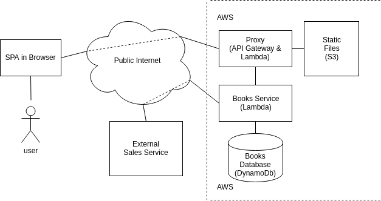

# Strat Bookstore Guide

In this guide we'll make a simple bookstore that uses a:
  A) Single page application frontend
  B) frontend proxy
  C) books service that depends on an external sales service
  D) books database

We'll take this application and run it locally and on the cloud via AWS.  Sounds like a lot of work, but we'll be done in less than 100 lines of code.

Here's a classic block diagram for what we're about to build:


To complete this guide make sure you've [installed stratc](./Getting%20Started), and if you plan on running in AWS do the AWS section of the [Hello World Guide](./Hello%20World).

## Books API

We'll start by creating a simple books service and a frontend proxy that we can use to access the service.  Our proxy will receive http events and route them to the books service.  Create a file and name it "Bookstore.st", and paste the following into it:

```st
service FrontendProxy {
  include "Http"
  Http { method: "get", path: "/api/books" } -> Books.getBooks
}

service Books {
  getBooks ():any -> "./getBooks.js"
}

```

Take a look at this code and try to figure out what it does.  You'll notice two of our boxes from the box diagram are "service"s in this file--FrontendProxy and Books.  By including Http into Frontend proxy we're telling strat that its a web server, and the following line states "get requests on the /api/books path should be sent to Books.getBooks".  The Books service then sends those requests to the getBooks.js file, which you need to create with this content:

```js
const getSales = async () => [];
const books = [
  {
    "name": "The Grapes of Wrath",
    "author": "John Steinbeck"
  },
  {
    "name": "War and Peace",
    "author": "Leo Tolstoy"
  },
  {
    "name": "The C Programming Language",
    "author": "Brian Kernighan and Dennis Ritchie"
  }
];

module.exports = async function () {
  const sales = await getSales();
  const salesSet = new Set((sales || []));
  return books.map(book => {
    return {
      sale: salesSet.has(book.author),
      ...book
    };
  });
};
```

This is our humble Books service.  It has a stub getSales function that we'll fill out later, some mock books, and an exported function that gets sales then responds with the mock books adding whether or not a book is on sale.

You may not believe it, but we've already got enough to deploy our API.  Run the following in a terminal in the same directory as both of the files you've just created:

```sh
stratc Bookstore.st && stratc Bookstore.sa
```

You should see the output:

```
"Successfully created Bookstore.sa"
http source listening on http://localhost:3000
```
We declared the getBooks API to be on the path /api/books, so using a browser or curl navigate to [localhost:3000/api/books](http://localhost:3000).

```sh
curl localhost:3000/api/books
```

You may notice a new file "Bookstore.sa"--this is a "system artifact" file that stratc builds when you run it against a strat (.st) file.  System artifact files are all of the resources in your system as well as instructions for how to host and run them.  When you run stratc against an .sa file, stratc loads up a Strat Virtual Substrate and uses that to execute your .sa file.  Unless you state [otherwise](./svs), stratc uses the single machine SVS that it ships with.

### Sales Dependency

Lets spice things up by adding an external service dependency.  If you've ever worked on a large service oriented architecture you know that no service exists in isolation, and connecting to external services is a massive PITA.